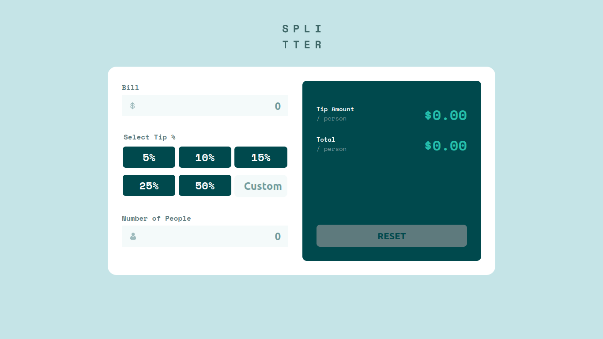

# Frontend Mentor - Tip calculator app solution

This is a solution to the [Tip calculator app challenge on Frontend Mentor](https://www.frontendmentor.io/challenges/tip-calculator-app-ugJNGbJUX). Frontend Mentor challenges help you improve your coding skills by building realistic projects.

## Table of contents

- [The challenge](#the-challenge)
  - [Screenshot](#screenshot)
  - [Links](#links)
- [Built with](#built-with)
  - [What I learned](#what-i-learned)
  - [Useful resources](#useful-resources)
- [Author](#author)

## The challenge

Users should be able to:

- View the optimal layout for the app depending on their device's screen size
- See hover states for all interactive elements on the page
- Calculate the correct tip and total cost of the bill per person

### Screenshot

### Links

- Solution URL: [Add solution URL here](https://your-solution-url.com)
- Live Site URL: [Add live site URL here](https://your-live-site-url.com)

### Built with

- Semantic HTML5 markup
- CSS custom properties
- Flexbox
- CSS Grid
- Mobile-first workflow
- Vanilla Javascript
- SCSS

### What I learned

This is my second solution for a challenge from FrontEndMentor.io. I decided to
use SCSS to modularize my CSS and break it up into components for readability and
maintainability. I also incorporated a library called Currency.js to facilitate
currency arithmatic.

### Useful resources

- [Currency JS](https://currency.js.org/) - Arithmatic with currency is difficult when using
  javascript. There are things to consider such as how to represent cents. Unfortunetly,
  representing cents with floating point numbers isn't enough. If done so that way, you may
  end up losing or incrementing cents when rounding up. Currency.js helps take care of this issue.
  It allows you to do currency arithmatic as well as easily output the result in the desired format you want.

## Author

- Website - [Hector Garcia](https://github.com/hectorgarcia07/)
- Frontend Mentor - [@hectorgarcia07](https://www.frontendmentor.io/profile/hectorgarcia07)
